# Bridge ↔ CRM Contract (Task C4)

This document is the **operating manual** for the bot bridge (Task B4,
runs on a separate VM) and the CRM dashboard (Tasks C2/C3, runs in this
seller service) to read and write the Chatwoot-style CRM tables in
`jaringan-dagang-seller` Postgres without stepping on each other.

It is the canonical contract: if the bridge and the CRM disagree, this
doc and the tests it points at win.

> **Status:** v1, post-C2. Schema is C1
> (`app/models/conversation.py`), CRM REST API is C2 (`app/api/`),
> bridge does not yet exist (B4).
>
> **Authoritative code paths:**
> * Schema: [`app/models/conversation.py`](../app/models/conversation.py)
> * CRM API: [`app/api/conversations.py`](../app/api/conversations.py),
>   `contacts.py`, `inboxes.py`, `labels.py`
> * Atomicity tests: [`tests/test_crm_api.py`](../tests/test_crm_api.py)
> * Idempotency tests: [`tests/test_crm_schema.py`](../tests/test_crm_schema.py)

---

## 1. Tables & ownership matrix

Each row is **store-scoped** by `store_id` (FK → `stores.id`, `ON DELETE
CASCADE`). The bridge MUST set `store_id` on every row it writes; the
CRM API enforces it on every read via `_resolve_store_scope` /
`can_access_store`.

| Table                   | Bridge writes                                                                                                                                                                                                                                                                                                                          | CRM writes                                                                                                                                                                | Idempotency key                                       |
| ----------------------- | -------------------------------------------------------------------------------------------------------------------------------------------------------------------------------------------------------------------------------------------------------------------------------------------------------------------------------------- | ------------------------------------------------------------------------------------------------------------------------------------------------------------------------- | ----------------------------------------------------- |
| `contacts`              | INSERT on first contact seen on a channel (WhatsApp number, web session). May UPDATE `name` / `email` / `phone` / `avatar_url` / `attributes` as the channel reveals them.                                                                                                                                                              | Agents MAY create a contact manually (e.g. walk-in customer); CRM does not currently mutate bridge-owned fields.                                                          | `(store_id, external_id)`, partial unique             |
| `inboxes`               | Never. Operator-provisioned only.                                                                                                                                                                                                                                                                                                       | `POST /api/inboxes` (super-admin or store member). Bridge reads `inboxes.config` JSONB to discover the channel-specific credentials it needs (e.g. WA `phone_number_id`). | n/a (no `external_id`); name+store+channel pragmatic. |
| `conversations`         | INSERT on first message of a new thread. UPDATE `last_message_at` + `last_message_preview` on every inbound msg. May increment `unread_agent_count` if `assignee_user_id IS NOT NULL` (see §6). MUST NOT directly write `state`, `handoff_at`, `resolved_at`, `assignee_user_id` — those are CRM-owned (state-machine transitions).      | Owns ALL state transitions: take-over, assign, resolve, reopen. Owns the **atomic** state-flip on first agent message (`bot_active → human_handoff`).                     | `(store_id, external_id)`, partial unique             |
| `messages`              | INSERTs `sender='contact'` (inbound buyer message) and `sender='bot'` (autonomous bot reply), both with `delivery='na'`. UPDATEs an agent message from `delivery='pending' → 'sent'` (and stamps `delivered_at`) once the channel acknowledges, or to `delivery='failed'` on permanent error. MUST NOT INSERT `sender='agent'` itself. | INSERTs `sender='agent'` (always `delivery='pending'`, `sender_user_id` set). MUST NOT manually flip `delivery` — that's the bridge's job.                                | `(conversation_id, external_id)`, partial unique      |
| `labels`                | Never.                                                                                                                                                                                                                                                                                                                                  | `POST /api/labels` only.                                                                                                                                                  | `(store_id, name)`, unique                            |
| `conversation_labels`   | Never.                                                                                                                                                                                                                                                                                                                                  | `POST /conversations/{id}/labels` (idempotent via `ON CONFLICT DO NOTHING`) and `DELETE /conversations/{id}/labels/{label_id}`.                                          | `(conversation_id, label_id)` (composite PK)          |

### Enum domains (Postgres types, pinned by C1)

| Postgres type        | Allowed values                                  | Source                                                  |
| -------------------- | ----------------------------------------------- | ------------------------------------------------------- |
| `conv_channel`       | `website`, `whatsapp`                           | `Channel` (`Inbox.channel`, `Conversation.channel`)     |
| `conversation_state` | `bot_active`, `human_handoff`, `resolved`       | `ConversationState` (`Conversation.state`)              |
| `message_sender`     | `contact`, `bot`, `agent`                       | `MessageSender` (`Message.sender`)                      |
| `message_delivery`   | `na`, `pending`, `sent`, `failed`               | `MessageDelivery` (`Message.delivery`)                  |

### Defaults (writer-side)

* `Conversation.state` → `bot_active`
* `Conversation.unread_agent_count` → `0`
* `Message.delivery` → `na` (override to `pending` only for agent messages — CRM does this)
* Timestamps (`created_at`, `updated_at`, `handoff_at`, `resolved_at`, `last_message_at`, `delivered_at`) → `NULL` unless explicitly set; `created_at` / `updated_at` are managed by `TimestampMixin`.

---

## 2. Conversation state machine

```mermaid
stateDiagram-v2
    [*] --> bot_active: Bridge creates conversation
    bot_active --> human_handoff: CRM POST /messages or POST /take-over\n(atomic flip; stamps handoff_at,\nassignee_user_id)
    human_handoff --> human_handoff: CRM POST /messages\n(no re-stamp; idempotent)
    human_handoff --> resolved: CRM POST /resolve\n(clears assignee_user_id;\nstamps resolved_at)
    resolved --> bot_active: CRM POST /reopen\n(clears resolved_at;\npreserves handoff_at + assignee_user_id\nfor audit)
    bot_active --> bot_active: Idempotent no-op (POST /reopen)
    human_handoff --> [*]: never (re-open or stay)
    resolved --> [*]: terminal until reopened
```



### Per-transition side effects

| From → To                       | Trigger                       | Side effects                                                                                                                                              | Idempotency                                                                                  |
| ------------------------------- | ----------------------------- | --------------------------------------------------------------------------------------------------------------------------------------------------------- | -------------------------------------------------------------------------------------------- |
| `bot_active → human_handoff`    | `POST /messages` (first agent msg) | INSERT `Message(sender=agent, delivery=pending)`; SET `state=human_handoff, handoff_at=now(), assignee_user_id=<caller>, last_message_at, last_message_preview, unread_agent_count=0`. All in one transaction (see §3). | First call writes; subsequent agent messages stay in `human_handoff` and do NOT re-stamp `handoff_at` / `assignee_user_id`. |
| `bot_active → human_handoff`    | `POST /take-over`             | SET `state=human_handoff, handoff_at=now(), assignee_user_id=<caller>`. No message inserted.                                                              | Calling on an already `human_handoff` conv is a no-op (no flush).                            |
| `human_handoff → resolved`      | `POST /resolve`               | SET `state=resolved, resolved_at=now(), assignee_user_id=NULL`.                                                                                            | Calling on already `resolved` is a no-op (no flush; original `resolved_at` preserved).       |
| `resolved → bot_active`         | `POST /reopen`                | SET `state=bot_active, resolved_at=NULL`. **Preserves** `handoff_at` and `assignee_user_id` for audit (which agent had it last).                          | Calling on already `bot_active` is a no-op.                                                  |

### Illegal transitions (rejected by CRM, must not be attempted by bridge)

* `resolved → human_handoff` directly via `POST /messages` → **409 Conflict**, body says "use /reopen first". Agents must reopen before sending another message.
* `resolved → human_handoff` directly via `POST /take-over` → **409 Conflict**, same reason.
* `bot_active → resolved` directly via `POST /resolve` is currently **allowed** (CRM doesn't gate; the route flips through regardless of current non-resolved state). The bridge MUST NOT call `/resolve`; resolution is a human action.
* Bridge attempting to write `Conversation.state` directly is a contract violation. See §1.

### What the bridge MUST do before replying

> Before generating an autonomous bot reply, the bridge MUST observe the
> current `state` of the conversation in the **same transaction** as the
> insert of its bot message, and abort the reply if `state !=
> 'bot_active'`.

Recommended bridge pattern (pseudo-Python, with asyncpg / SQLAlchemy):

```python
async with conn.transaction():
    row = await conn.fetchrow(
        "SELECT state FROM conversations WHERE id = $1 FOR UPDATE",
        conversation_id,
    )
    if row["state"] != "bot_active":
        # An agent took over (or the conversation was resolved) between
        # the bridge's last poll and now. Drop the planned bot reply.
        return  # transaction rolls back, no message inserted

    # Safe to generate + insert the bot message. The FOR UPDATE row lock
    # blocks any agent's POST /messages until we commit; the CRM uses the
    # same FOR UPDATE on the conversation row, so the two paths serialise.
    await conn.execute(
        "INSERT INTO messages(conversation_id, store_id, sender, content, "
        "delivery, external_id) VALUES ($1, $2, 'bot', $3, 'na', $4) "
        "ON CONFLICT (conversation_id, external_id) WHERE external_id IS NOT NULL "
        "DO NOTHING",
        conversation_id, store_id, json.dumps(content), bridge_external_id,
    )
```

Why this works: `app/api/conversations.py:post_agent_message` opens the
conversation row with `SELECT ... FOR UPDATE` before inserting the agent
message and flipping the state. Postgres serialises both `FOR UPDATE`
lockers on the same row, so the bridge can't read `state='bot_active'`
in parallel with the agent's flip and insert a bot reply on top of the
human. The race that this contract closes is documented in C2's headline
test (see §3).

---

## 3. Atomic-handoff invariant (the headline contract)

`POST /api/conversations/{id}/messages` MUST commit the **agent-message
INSERT** and the `state → human_handoff` **UPDATE** in a single
transaction. If they landed separately, the bridge could read
`state=bot_active` after the message INSERT had landed but before the
UPDATE — and reply with a bot message on top of the human.

The CRM enforces this by:

1. Loading the conversation row with `SELECT ... FOR UPDATE` (in
   `_load_conversation_for_user(..., for_update=True)`).
2. `db.add(msg)` for the new `Message` row.
3. Mutating the `Conversation` ORM object (`state`, `handoff_at`, etc.).
4. A single `await db.flush()` flushes both writes into the open
   transaction.
5. The route does NOT call `commit()` itself — `get_db()` commits on
   successful return and rolls back on exception, so a mid-handler
   crash guarantees neither write becomes visible.

The bridge MUST NOT attempt to bypass this by writing agent messages
directly. The only way an agent message reaches the messages table is
via the CRM API.

### Proof / regression

The PG-gated test
`tests/test_crm_api.py::test_handoff_atomicity_real_postgres` exercises
this against live Postgres:

* Happy path: drives `post_agent_message` on a `bot_active` conv,
  commits, then a fresh session asserts the message + state flip both
  landed.
* Negative path: drives the same flow inside a transaction that raises
  after the handler runs, then a fresh session asserts NEITHER the
  message NOR the state flip landed.

A unit-test counterpart in the same file (`TestPostAgentMessageHeadlineContract`)
runs without Postgres and pins the in-process atomicity contract (one
flush, no in-route commit, no in-route rollback).

---

## 4. Outbound human-agent delivery queue (DB-as-queue)

When an agent sends a message, it lands as
`(sender='agent', delivery='pending')`. The bridge is the **only** writer
that flips it to `'sent'` (or `'failed'`). This makes the `messages`
table itself the outbound delivery queue.

### Polling loop (recommended)

```sql
BEGIN;
SELECT m.id, m.conversation_id, m.store_id, m.content, c.channel, c.external_id AS conv_external_id
FROM messages m
JOIN conversations c ON c.id = m.conversation_id
WHERE m.sender = 'agent'
  AND m.delivery = 'pending'
ORDER BY m.created_at
FOR UPDATE OF m SKIP LOCKED
LIMIT 50;
-- (per row) attempt delivery via the channel selected by c.channel
-- (per row) on success:
UPDATE messages SET delivery = 'sent', delivered_at = now() WHERE id = :id;
-- (per row) on failure:
UPDATE messages SET delivery = 'failed' WHERE id = :id;
COMMIT;
```

* `SKIP LOCKED` lets multiple bridge workers (or retries) coexist
  safely. Locks on a row are held until commit / rollback; a parallel
  worker simply skips and picks the next pending row.
* The bridge poll uses **no `external_id`** filter — the CRM does not
  set `external_id` on agent messages today (it's `NULL` on insert),
  and the bridge has no need for an idempotency key on the read side
  (the row PK is the queue key).
* Composite index `ix_messages_sender_delivery_created_at` (added in C4
  on `app/models/conversation.py`) covers the predicate + ORDER BY so
  this query stays fast as `delivery='sent'` rows accumulate. See §10
  for the operator action item.

### Success: `UPDATE messages SET delivery='sent', delivered_at=now()`

The bridge MUST set `delivered_at` together with the flip to `'sent'`.
The CRM UI keys "delivered ✓" / time off `delivered_at` (not on
`updated_at`, which the ORM bumps on any write).

### Failure: `UPDATE messages SET delivery='failed'`

For v1, a failed delivery stays `'failed'` and the bridge logs +
alerts. **Retry policy is TBD post-v1.** Today's contract:

* `'failed'` is terminal (the bridge does not auto-retry).
* The agent UI shows the message as failed and offers a manual resend
  (which inserts a NEW agent message; the old `'failed'` row stays for
  audit).
* Bridge MUST NOT mutate `delivery` away from `'failed'` once stamped.

---

## 5. Idempotency

Every bridge-side INSERT carries a stable `external_id` so replay (e.g.
crash-and-restart in the middle of processing a webhook batch) is a
**no-op**.

### Partial unique indexes (C1)

| Table           | Idempotency index                                                              | Predicate (Postgres-only)           |
| --------------- | ------------------------------------------------------------------------------ | ----------------------------------- |
| `contacts`      | `uq_contacts_store_external_id` UNIQUE `(store_id, external_id)`               | `WHERE external_id IS NOT NULL`     |
| `conversations` | `uq_conversations_store_external_id` UNIQUE `(store_id, external_id)`          | `WHERE external_id IS NOT NULL`     |
| `messages`      | `uq_messages_conv_external_id` UNIQUE `(conversation_id, external_id)`         | `WHERE external_id IS NOT NULL`     |

Agent-created rows (no `external_id`) are not constrained — the partial
predicate only fires when the column is non-null.

### UPSERT pattern (use this verbatim)

```sql
INSERT INTO messages (
    id, conversation_id, store_id, sender, content, delivery,
    external_id, created_at, updated_at
)
VALUES ($1, $2, $3, 'contact', $4, 'na', $5, now(), now())
ON CONFLICT (conversation_id, external_id)
WHERE external_id IS NOT NULL
DO NOTHING;
```

The same shape applies to `contacts` and `conversations` — substitute
the unique tuple. `DO NOTHING` is the v1 default; a future "UPDATE on
replay" variant would use `DO UPDATE SET ...` but only the bridge can
own that decision per column.

The contract test
`tests/test_crm_schema.py::test_idempotency_contract_postgres_only`
pins the constraint by inserting two rows with the same
`(store_id, external_id)` and asserting an `IntegrityError` on the
second flush.

---

## 6. `unread_agent_count` semantics

Today: stays `0` on every CRM agent-message POST (CRM zeroes it because
the agent has just seen the thread). The bridge SHOULD increment it on
inbound `contact` messages **only if** `conversation.assignee_user_id IS
NOT NULL` — i.e., a human owns the thread but isn't actively reading.

In v1 there is only one effective agent role per store, so this counter
isn't load-bearing for UX. It's reserved for a future "unread by THIS
agent" feature; until then, the bridge MAY skip incrementing it without
breaking anything.

```sql
-- Bridge-side increment (optional, on inbound contact msg):
UPDATE conversations
SET unread_agent_count = unread_agent_count + 1,
    last_message_at = now(),
    last_message_preview = $1
WHERE id = $2
  AND assignee_user_id IS NOT NULL;
```

The CRM zeroes the counter inside the `POST /messages` transaction
(`conv.unread_agent_count = 0`); agents reading a thread WITHOUT sending
a message do NOT yet zero it (no read-receipt endpoint in v1).

---

## 7. Rich content shape (`messages.content` JSONB)

The column is plain `JSONB`. **The shape is not enforced at the DB
layer** — the contract lives here. Both renderers (the bot chat widget
in B5 and the CRM thread view in C3) MUST gracefully ignore unknown
block types so future additions don't need a migration.

```jsonc
{
  "text": "Sure — here are two options:",   // required, plain UTF-8
  "blocks": [                                // optional
    {
      "type": "product_card",
      "sku": "safiya-shea-500g",             // canonical SKU id from catalog
      "title": "Shea Butter 500g",
      "price_idr": 250000,
      "image_url": "https://safiya.beliaman.com/img/shea-500g.jpg",
      "url": "https://safiya.beliaman.com/products/shea-500g"   // optional
    },
    {
      "type": "image",
      "url": "https://example.com/qr.png",
      "alt": "QR code for store"             // optional
    },
    {
      "type": "qr",
      "url": "https://beliaman.com/r/safiya",  // the URL encoded by the QR
      "caption": "Scan to open Safiya"        // optional
    }
  ]
}
```

### Block-type rules

* `text` is REQUIRED on every message. Renderers can fall back to it
  when they don't know any block types.
* `blocks` is OPTIONAL. Missing or `[]` means a plain-text message.
* Each block MUST have a `type` discriminator (string).
* Unknown `type` values MUST be silently ignored by the renderer
  (forward compatibility — adding block types is a non-migration
  change).
* Block size is bounded by the JSONB ceiling (~256 MB in Postgres); in
  practice keep messages under ~16 KB or split into multiple messages.
* `image_url` / `url` MUST be absolute https URLs. The CRM and bridge
  do not rewrite relative URLs.

### Wire compatibility with the CRM API

The wire-shape is identical to what `POST /api/conversations/{id}/messages`
accepts (`MessageContent` Pydantic model in `app/api/conversations.py`):

```json
{ "content": { "text": "...", "blocks": [ ... ] } }
```

The CRM passes `content.model_dump(exclude_none=True)` straight into the
`messages.content` column, so what the agent posts is what the bridge
reads.

---

## 8. Multi-tenant rules

* Every CRM row is `store_id`-scoped via FK to `stores.id` (CASCADE on
  delete).
* The CRM REST API gates **every** read and write on
  `app/auth/deps.py:can_access_store`:
  * Super-admins (`SUPER_ADMIN_EMAILS` = `hallucinogenplus@gmail.com`,
    `lwastuargo@gmail.com`) see all stores; may omit `store_id` to query
    across all of them.
  * Non-super-admins MUST pass `store_id` (`400` if missing); their
    `StoreMembership` row gates access (`403` if absent).
  * Inaccessible single-row reads (GET `/conversations/{id}`) return
    `404` — **not** `403` — so we don't leak that the row exists. Same
    for label cross-store attaches.

* The bridge runs **with elevated privileges** (it's an internal
  service). It MUST still set `store_id` correctly on every row it
  writes; the partial-unique-index idempotency keys are
  `(store_id, external_id)`, so getting `store_id` wrong would let two
  different stores collide.
* The bridge SHOULD filter at the inbox level: a conversation belongs to
  an inbox, and an inbox knows its `channel`. If a store has no inbox
  configured for the channel a message arrives on, the bridge skips
  (the contract is "stores opt in by creating an inbox").
* **Future:** a per-store `Store.crm_enabled` boolean would let stores
  toggle CRM participation without deleting inboxes. NOT in this task —
  flagged as a follow-up. Until then, "has an inbox for the channel"
  is the opt-in signal.

---

## 9. Failure modes & UX edge cases

| Scenario                                                       | Behaviour today                                                                                                                                                  | Owner    |
| -------------------------------------------------------------- | ----------------------------------------------------------------------------------------------------------------------------------------------------------------- | -------- |
| Bridge can't reach channel (WA outage, etc.)                   | Agent message stays `delivery='pending'`. Queue protects it; bridge re-polls. No data loss.                                                                       | Bridge   |
| Agent races bot on a `bot_active` conv                         | `FOR UPDATE` on conv row serialises the two. Whichever transaction commits first wins; the other reads the new state and either skips (bridge) or returns OK (CRM still inserts agent msg, no extra flip). | Both     |
| Conv transitions to `resolved` while agent message is in flight | `POST /messages` returns `409`. Agent UI shows "conversation resolved; reopen to send".                                                                          | CRM      |
| Bridge crashes mid-poll (`pending → sent` UPDATE didn't commit) | Row stays `pending`; next poll picks it up. `SKIP LOCKED` means a parallel worker doesn't re-deliver concurrently.                                               | Bridge   |
| Deleted user (agent) row                                       | `assignee_user_id` and `sender_user_id` FKs are `ON DELETE SET NULL`. Agent messages remain, just with no author link.                                            | Schema   |
| Cross-store label attach (`POST /conversations/{id}/labels`)   | Returns `404` (same as missing label) — does not leak existence of cross-store labels.                                                                            | CRM      |
| Replay (same `external_id` twice)                              | Partial unique index → `IntegrityError`. UPSERT pattern (`ON CONFLICT DO NOTHING`) suppresses it cleanly.                                                          | Bridge   |
| Bot reply attempts on a `human_handoff` conv                   | Bridge MUST observe `state` `FOR UPDATE` before inserting. If `state != 'bot_active'`, abort. The CRM cannot prevent a misbehaving bridge from inserting a bot message anyway — this is a bridge-side discipline. | Bridge   |
| Bot reply attempts on a `resolved` conv                        | Same as above; bridge MUST abort.                                                                                                                                  | Bridge   |
| Inbound contact message on a `resolved` conv                   | Bridge SHOULD reopen the conv: write the contact message, then `POST /api/conversations/{id}/reopen` via the CRM API. The contract here says "buyer message reopens"; the schema doesn't auto-do this on its own. (Open: should the CRM expose a bridge-only "post inbound + reopen" endpoint? Tracked as a B4 question.) | Bridge   |

---

## 10. Operator action items (post-merge)

* **Apply the C4 composite index against the live DB before the bridge
  goes live** — without it, the pending-message poll degrades as
  `delivery='sent'` rows accumulate:

  ```bash
  # Dry-run (safe, no DB connection):
  python scripts/add-crm-pending-message-index.py

  # Apply against Neon:
  DATABASE_URL=postgresql+asyncpg://... \
      python scripts/add-crm-pending-message-index.py --apply
  ```

  The script is `CREATE INDEX IF NOT EXISTS`-based, so re-running is a
  no-op.

* The C1 CRM tables themselves were created via either
  `scripts/add-crm-tables.py --apply` or `POST /api/admin/migrate`. If
  they don't exist on the target DB yet, run that first.

---

## 11. What's explicitly OUT of scope for v1

* SLAs on agent response time. No "first-response under N seconds" gauge.
* Auto-routing / round-robin assignment. Agents manually take over /
  re-assign.
* Canned responses / snippets / shortcuts.
* Triggers / events / webhooks fired on state transitions (no Slack
  ping, no email). Notifications are deferred.
* Analytics dashboards. Counters like "messages per agent per day" can
  be computed ad-hoc from the schema; no materialised aggregates.
* Agent permissions beyond store-scope. A store member has the same
  permissions on every conversation in their stores.
* SSE / websocket push of new messages to the CRM UI. The CRM polls.
  Push is a post-v1 task (would slot in alongside `unread_agent_count`
  read receipts).
* Retry strategy for `delivery='failed'`. v1 logs and alerts; v1.1 will
  pick a backoff policy.
* `Store.crm_enabled` toggle column. Opt-in today is "has an inbox for
  the channel".

---

## 12. Glossary

* **Bridge** — Task B4 (separate VM). Talks to channel APIs (WA, web
  widget), writes inbound `contact` messages, runs the bot to write
  `bot` reply messages, polls the pending-delivery queue to ship agent
  messages out. Has elevated DB credentials; runs the same Postgres
  connection pool model as the seller service.
* **CRM** — Task C2/C3. FastAPI routes in `app/api/conversations.py` +
  the React dashboard. Owns the state machine; agents authenticate via
  Firebase ID token.
* **Super-admin** — User whose email is in `SUPER_ADMIN_EMAILS`. Sees
  all stores; may omit `store_id` query param.
* **Store-scoped** — Every row has a `store_id` FK; reads filter by it
  unless the caller is a super-admin asking for the cross-store view.
* **Idempotency key** — `external_id` set by the bridge on every insert
  it owns. Replay (same key, same store/conv) is a no-op via partial
  unique indexes.

---

## 13. Change log

* **2026-05-20** — Initial v1 contract (C4). C1 schema, C2 API both
  in. Bridge (B4) does not yet exist; this doc defines what it must
  implement. Composite index `ix_messages_sender_delivery_created_at`
  added in this task.
